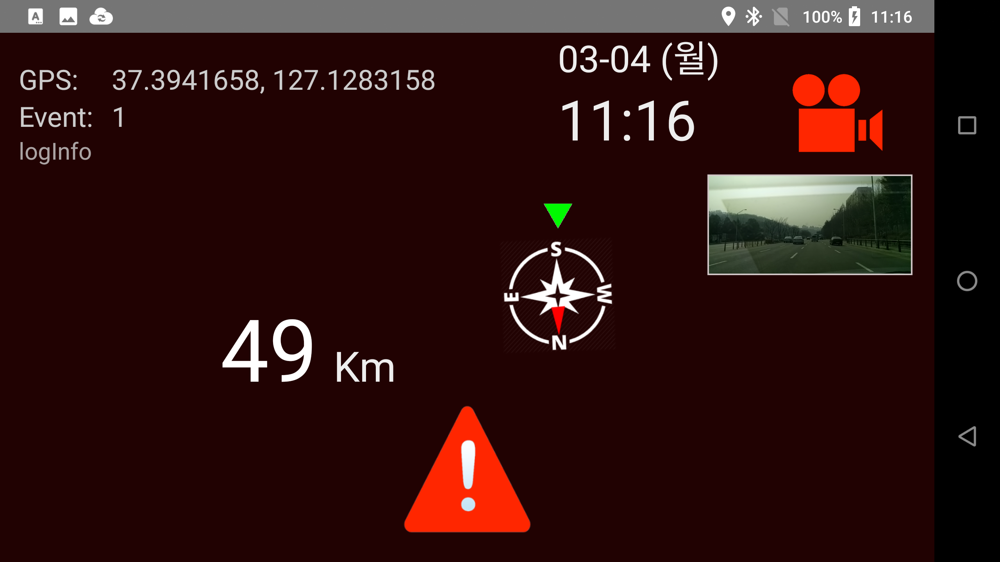
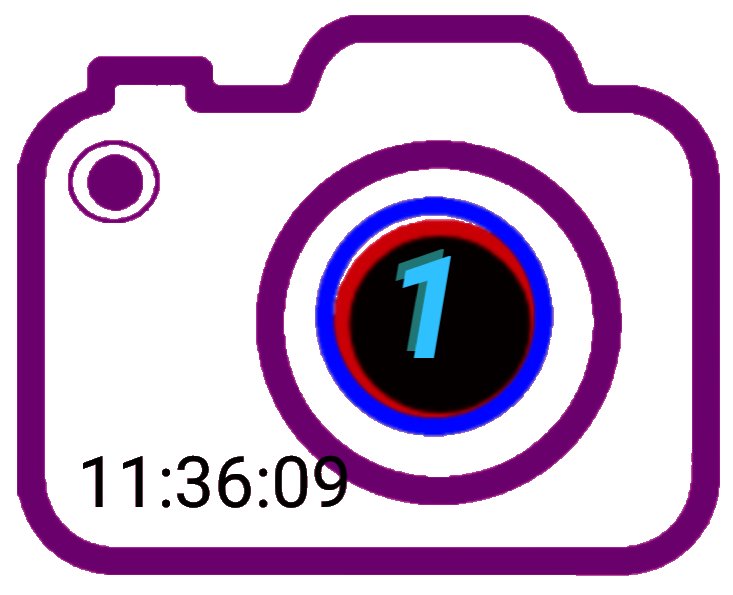

# blackbox
**blackbox** is the android application to take video records while driving

- recording normal videos into today folder with start/stop button and auto start function
- when event button touched, make separate video with multiple camera snaps
- create separate text file containing GPS coordinates
- provides small monitor screen
- show car speed, and direction with rotating compass image
- old normal video recording automatically will be removed if remaining space is less then 2Gb
- provides big home widget for easy launch

<H1>Screenshots and How to operate</H1>

<H3>Main Screen</H3>

- Display GPS icon if GPS is active
- Display event record counts
- Display current date/time
- Display preview screen
- Display Compass
- Display speed in Kilometer, accumulated today drive Kilometers
- Start/Stop recording button
- Emergency Recoding button (without audio)
- Exit button

<br>&nbsp;&nbsp;&nbsp;&nbsp;&nbsp;&nbsp;&nbsp;&nbsp;&nbsp;&nbsp;&nbsp;&nbsp;


<H3>Home Widget</H3>

- Display event record counts (if none shows "ready")
- Display time in every 30 minutes
- Use to load application quickly

<br>&nbsp;&nbsp;&nbsp;&nbsp;&nbsp;&nbsp;&nbsp;&nbsp;&nbsp;&nbsp;&nbsp;&nbsp;



<H3>Permission Required</H3>

```
    <uses-permission android:name="android.permission.CAMERA" />
    <uses-permission android:name="android.permission.RECORD_AUDIO" />
    <uses-permission android:name="android.permission.WRITE_EXTERNAL_STORAGE" />
    <uses-permission android:name="android.permission.ACCESS_FINE_LOCATION" />
```

<H1>Comments</H1>

<H3>Coded by</H3>

-  **Woncherl Ha** - riopapa@gmail.com

<H3>What I learned in this application</H3>

- Google GoogleApiClient
- onKeyDown : to accept bluetooth remote control
- AsyncTask : to merge mp4 files in separate task (normal saving and event saving) while recording
- SoundPool : to beep in some activities
- FragmentCompat.OnRequestPermissionsResultCallback
camera.open, release power cable connection status
- MediaRecorder : recording, MEDIA_RECORDER_INFO_NEXT_OUTPUT_FILE_STARTED

<H3>Updates / Changes</H3>

- 2019.02.09 : README.md fully revised

<H3>Issues not fixed yet</H3>

- Unexpected shut down sometime, sorry :-p

<H3>Thanks all persons in GitHub for good examples.</H3>
