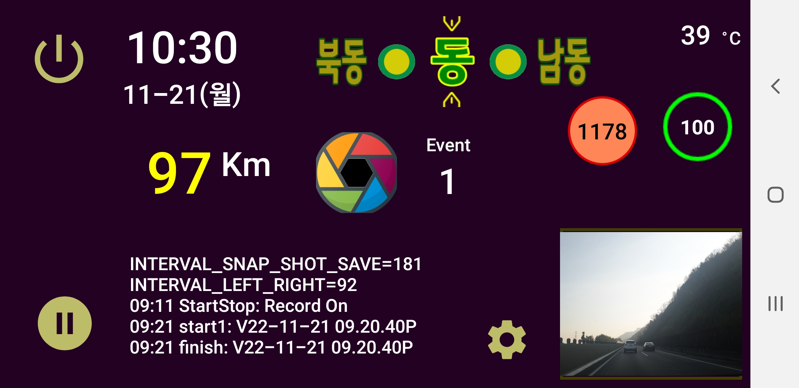

# blackbox
**blackbox** is the android application to take video records while driving

- recording normal videos into today folder with start/stop button and auto start function
- when event button touched, make separate video with multiple camera snapshots, event video file contains GPS info in file name
- provides small monitor screen
- show car speed, and direction
- remove old normal video recording automatically if remaining space is small
- provides big home widget for easy launch

<H1>Screenshots and How to operate</H1>

<H3>Main Screen</H3>

- Display event record counts
- Display current date/time
- Display preview screen
- Display Compass
- Display current speed, today's cumulative distance  in Kilometer (information from OBDII bluetooth device)
- Start/Stop recording button
- Save Screen Images while captured while recording video   
- Emergency Recoding button (with audio)
- Phone Temperature in Celcius  
- Exit button

<br>&nbsp;&nbsp;&nbsp;&nbsp;&nbsp;&nbsp;&nbsp;&nbsp;&nbsp;&nbsp;&nbsp;&nbsp;


<H3>Widget Screen</H3>

- Display event record counts (if none shows "None")
- Use to load application quickly

<br>&nbsp;&nbsp;&nbsp;&nbsp;&nbsp;&nbsp;&nbsp;&nbsp;&nbsp;&nbsp;&nbsp;&nbsp;


<H3>Related Application</H3>

<H4> Black Photo</H4>
- Show black box camera images folders
- Show individual photo shots
- Remove saved records/photos

<H4> Black Wait </H4>
- Invoked when "I'll be back" button
- Just spending some seconds

<H3>Permission Required</H3>

```
    <uses-permission android:name="android.permission.CAMERA" />
    <uses-permission android:name="android.permission.RECORD_AUDIO" />
    <uses-permission android:name="android.permission.WRITE_EXTERNAL_STORAGE" />
    <uses-permission android:name="android.permission.READ_EXTERNAL_STORAGE" />
    <uses-permission android:name="android.permission.ACCESS_FINE_LOCATION" />
    <uses-permission android:name="android.permission.ACCESS_COARSE_LOCATION" />
    <uses-permission android:name="android.permission.ACCESS_BACKGROUND_LOCATION" />
    <uses-permission android:name="android.permission.BLUETOOTH" />
    <uses-permission android:name="android.permission.BLUETOOTH_ADMIN" />
    <uses-permission android:name="android.permission.SYSTEM_ALERT_WINDOW" />
    <uses-permission android:name="android.permission.READ_PHONE_STATE" />
```

<H1>Comments</H1>

<H3>Coded by</H3>

-  **Woncherl Ha** - riopapa@gmail.com

<H3>What I learned in this application</H3>

- Google GoogleApiClient
- onKeyDown : to accept bluetooth remote control
- AsyncTask : to merge mp4 files in separate task (normal saving and event saving) while recording
- SoundPool : to beep in some activities
- FragmentCompat.OnRequestPermissionsResultCallback
camera.open, release power cable connection status
- MediaRecorder : recording, MEDIA_RECORDER_INFO_NEXT_OUTPUT_FILE_STARTED
- CameraDevice : supports MediaRecorder, Preview Screen, Screen shot simultaniously
- OBDII : access car bluetooth device

<H3>Updates / Changes</H3>

- 2021.05.05 : androidx applied, capture imageshot
- 2019.02.09 : README.md fully revised
- 2022.05.06 : Updated

<H3>Issues not fixed yet</H3>

- Unexpected shut down sometime (untrackable), sorry :-p

<H3>Thanks all persons in GitHub for good examples.</H3>